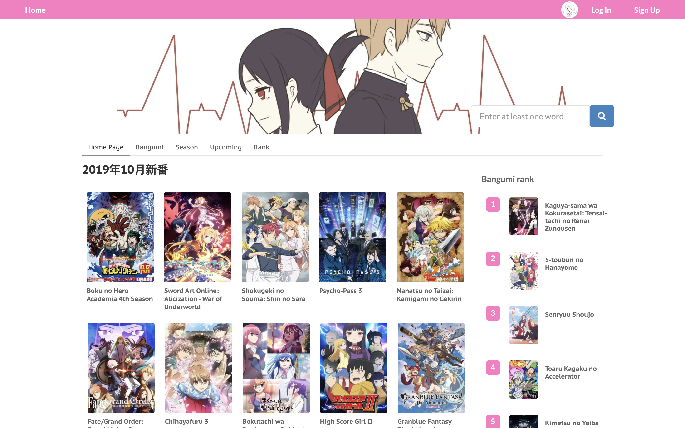
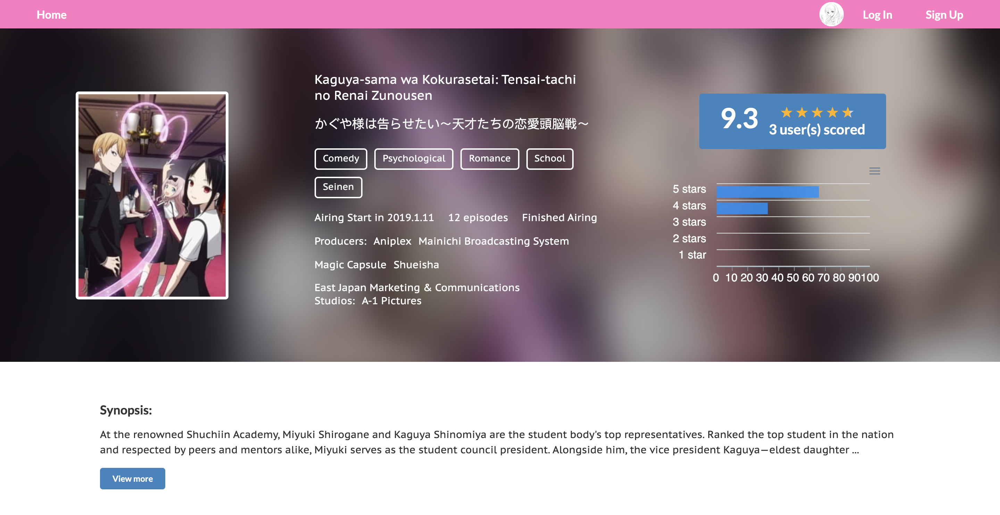
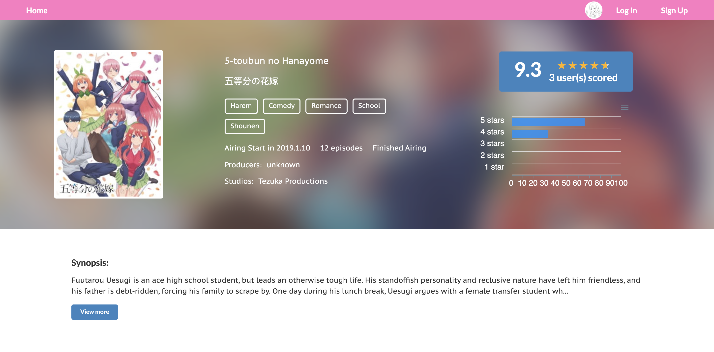
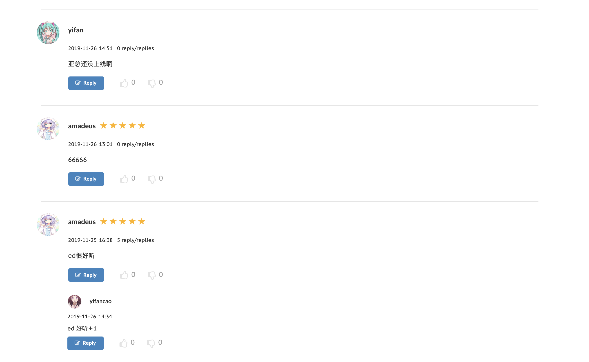

  

<h1 align="center">Aniscore</h1>

Aniscore is an app for scoring bangumi(japanese anime), implemented with reactjs, nodejs, express, mongodb and redux.

## Web View
### Home Page

### Detail Page
  
 

## Comment

### User Page
