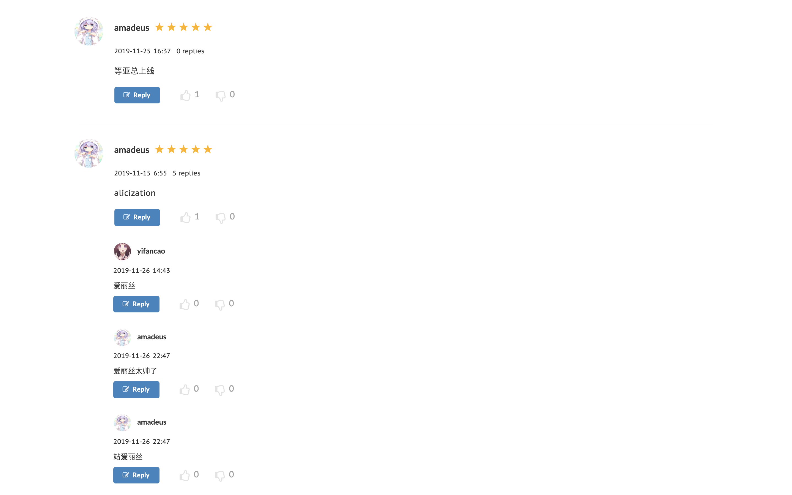

<h1 align="center">Aniscore Android</h1>

## Intro
Aniscore is an app for scoring bangumi(japanese anime), implemented with reactjs, nodejs, express, mongodb and redux.

## Web View
### Home Page

### Detail Page
  

## Comment

### User Page
